# Fleet Management System - Tenderd Assignment

## System Architecture

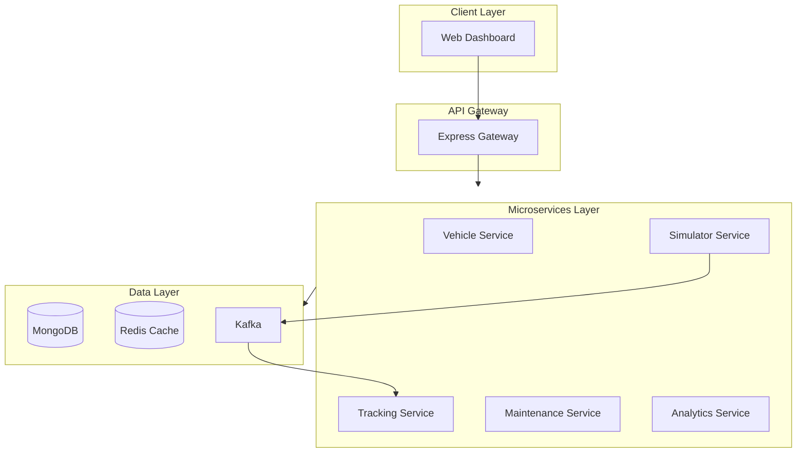

## Why Microservices?

I've chosen a microservice architecture for this system for several key benefits:
- **Scalability**: Individual services can be scaled independently based on demand
- **Fault Isolation**: Issues in one service don't affect the entire system
- **Technology Flexibility**: Each service can use the most suitable technology stack
- **Independent Deployment**: Services can be developed, tested and deployed separately
- **Easier Maintenance**: Smaller codebases are easier to understand and maintain

## Component Architecture

### API Gateway

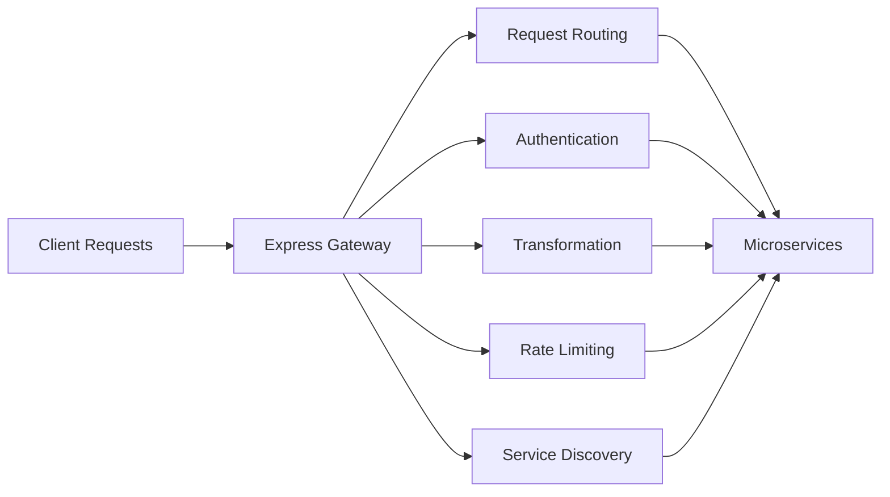

### Vehicle Service

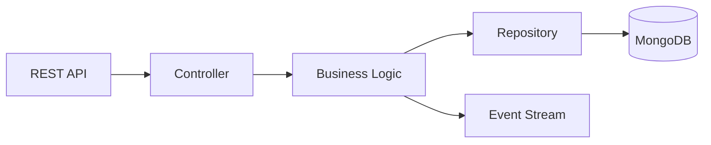

### Tracking Service

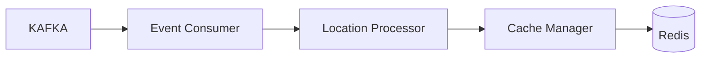

### Maintenance Service

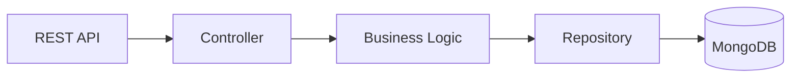

### Analytics Service

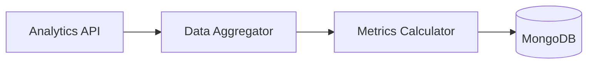

### Simulator Service

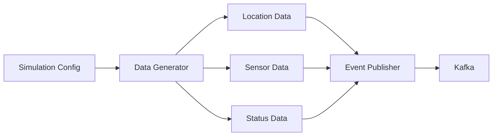

## Data Flow

### Real-time Location Update

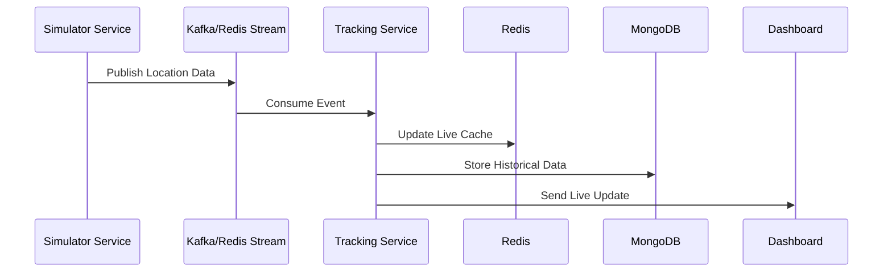

### Vehicle Registration

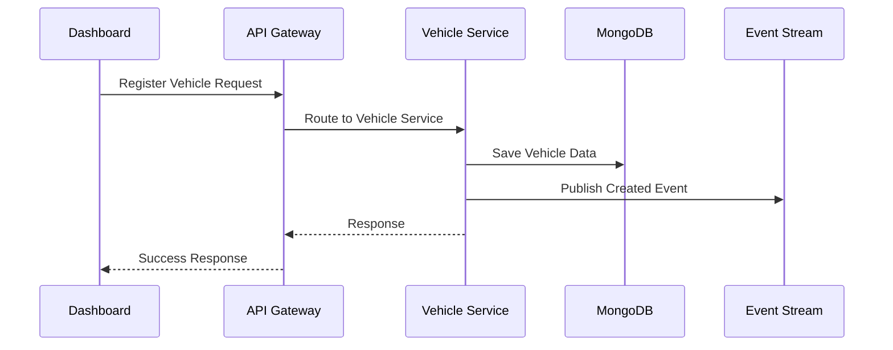

## Technology Stack

### Backend
- Node.js/Express
- MongoDB
- Redis
- Kafka/Event Streaming
- API Gateway: Express Gateway

### Frontend
- React
- Redux
- Map integration (e.g., Google Maps)

### DevOps
- Docker
- Docker Compose
- Github Actions

## Database Schema

### MongoDB Collections

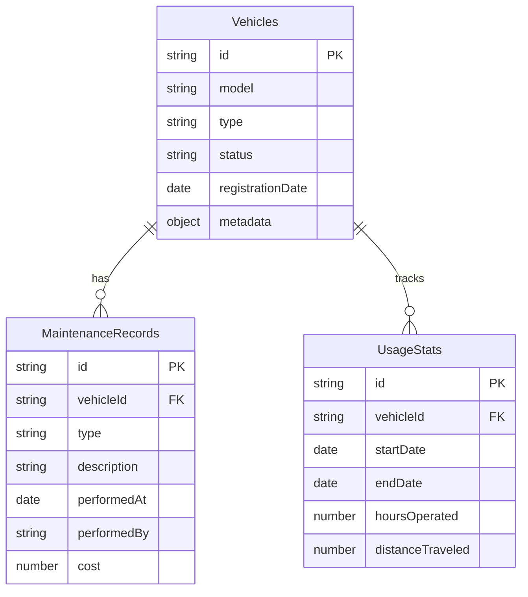

### Redis Data Structure

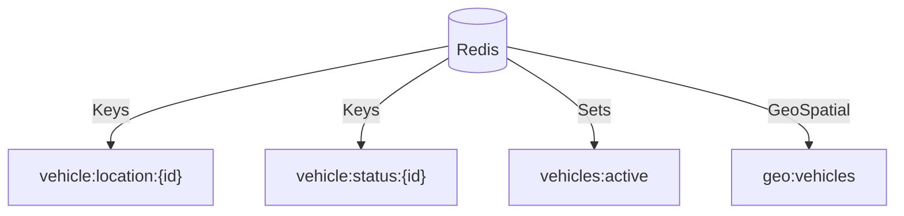

## Docker Architecture

### Containerized Services

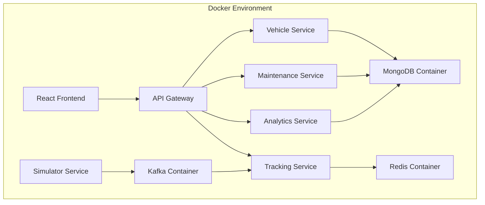

### Docker Compose Structure

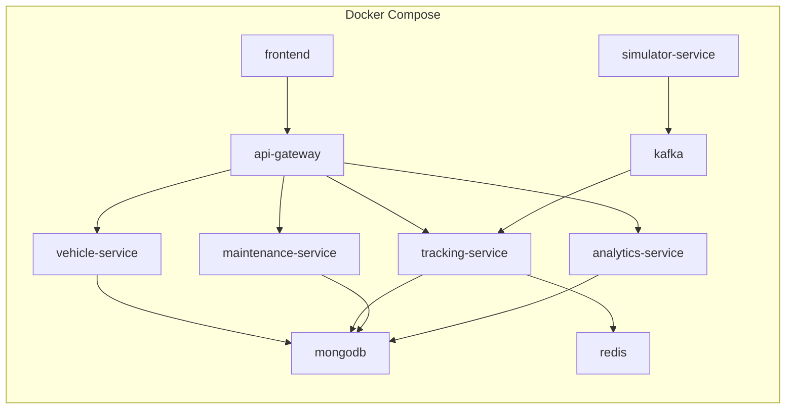

## API Architecture

### API Gateway Routes

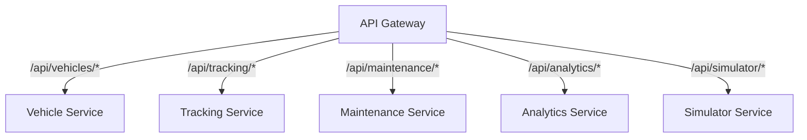

### RESTful Endpoints

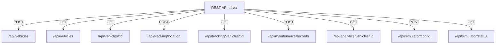

## Frontend Architecture

### React Component Structure

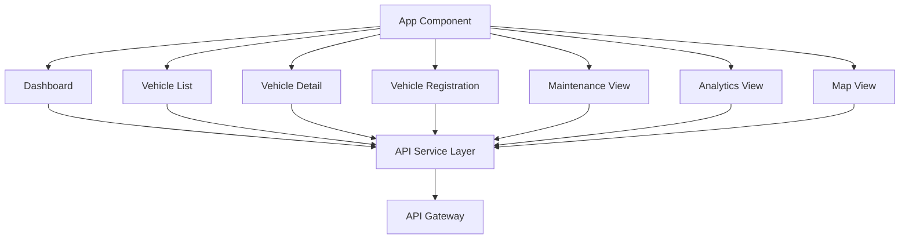

## Deployment Flow

### Development to Production

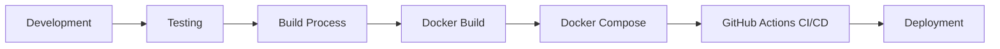

## Project Structure
```
Fleet-Management-System/
├── frontend/         # React-based web dashboard
├── backend/          # Microservices
│   ├── api-gateway/  # API Gateway service
│   ├── vehicle/      # Vehicle service
│   ├── tracking/     # Tracking service
│   ├── maintenance/  # Maintenance service
│   ├── analytics/    # Analytics service
│   └── simulator/    # IoT data simulator service
├── docs/             # Documentation
└── .docker/          # Docker configuration
```

### Event System

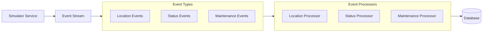